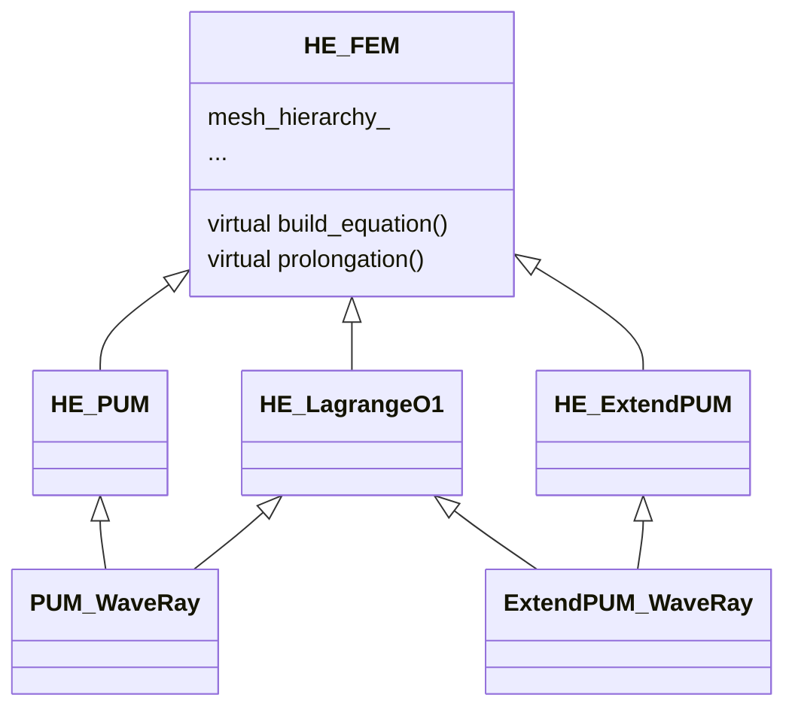

# PUM-Based Wave-Ray Multigrid

This repository contains the codes for the master thesis project `PUM-Based Wave-Ray multigrid`, the results of numerical experiments can be found at 

`document/Master_Thesis_Liaowang.pdf`

This markdown aims to show how to repeat results of the numerical experiments. Details can be found at the markdown file in each subdirectory.

At first, cmake with the release mode

```bash
mkdir release
cmake -DCMAKE_BUILD_TYPE=Release ..
make
```


- Resolution test for PUM spaces

  - Results are in section 5.4
  - Source file lies in `PUM/tests/pum_resolution.cpp`  and 
  - Remember to include `add_subdirectory(Pum)` in `CMakeLists.txt`
  - Run `make` in `release` folder
  - Run the executable `./Pum/pum_resolution`

- PUM Wave-Ray method

  - Results are in section 7.3 

  - Source file lies in `Wave_Ray_Cycle/Wave_Ray.cpp`, and some useful functions are in `utils/mg_element.h`

  - `add_subdirectory(Wave_Ray_Cycle)` in `CMakeLists.txt`

  - ```bash
    cd release
    make
    ./Wave_Ray_Cycle/Wave_Ray
    ```

- GMRES

  - Results are in section 8.3

  - Source file: `KrylovEnhance_mg.cpp`

  - `add_subdirectory(Krylov)` in `CMakeLists.txt`

  - ```bash
    cd release
    make
    ./Krylov/mg_krylov
    ```

- Local impedance smoothing

  - Results in section 8.4

  - Files: `local_impedance/local_impedance_smoothing.cpp`

  - `add_subdirectory(local_impedance)` in `CMakeLists.txt`

  - ```bash
    cd release
    make
    ./local_impedance/local_impedance_smoothing
    ```

    


## classes




