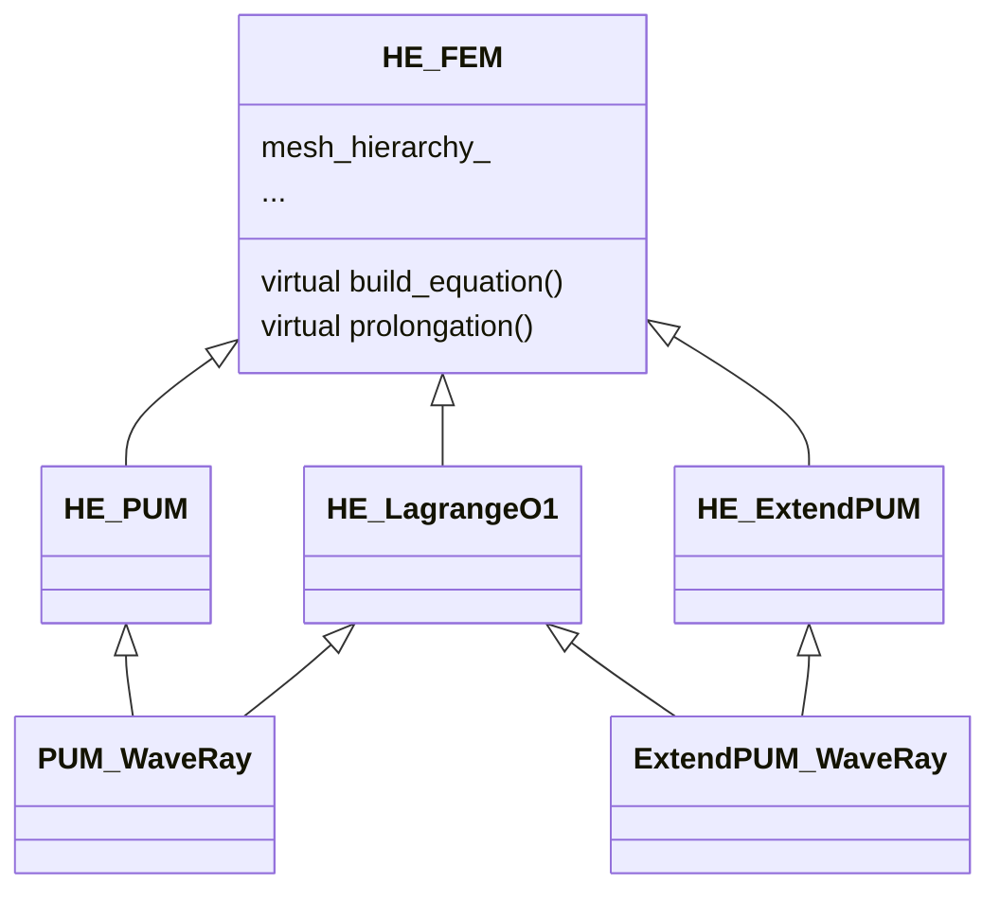

# PUM-Based Wave-Ray Multigrid

This repository contains the codes for the master thesis project `PUM-Based Wave-Ray multigrid`,

this project aims at solving the 2-dimension Helmholtz equation
$$
\begin{aligned}
\Delta u+k^2u&=0\quad\text{in}\;\Omega\\
\frac{\partial u}{\partial\boldsymbol{n}}-iku&=g\quad\text{on}\;\Gamma_R \\
u&=h\quad\text{on}\;\Gamma_D
\end{aligned}
$$

## classes

